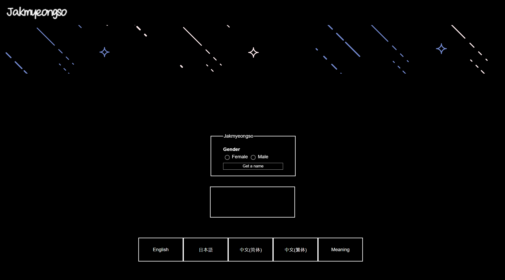

# Jakmyeongso

## Get your own creative Korean name
Whether you require a unique name for a Korean character in your story or desire a distinct Korean name for yourself, worry no more! Jakmyeongso, a Korean name generating webpage, enables users to acquire a name with just a few simple clicks.   
### Obtain a gender-appropriate name 
Acquire a gender-appropriate name effortlessly by choosing either male or female and simply clicking 'Get a name'. Jakmyeongso's name generating system was meticulously crafted to produce natural-sounding names that perfectly align with the selected gender.
### Translate your name and discover its meaning
Uncover the translation of your name and explore its profound meaning with Jakmyeongso. It supports five languages for names: Korean, English, Japanese, simplified Chinese, and traditional Chinese. Say goodbye to relying on unreliable translators for proper nouns. Additionally, each name is accompanied by its English meaning. Embark on a journey of creativity.

## Link
